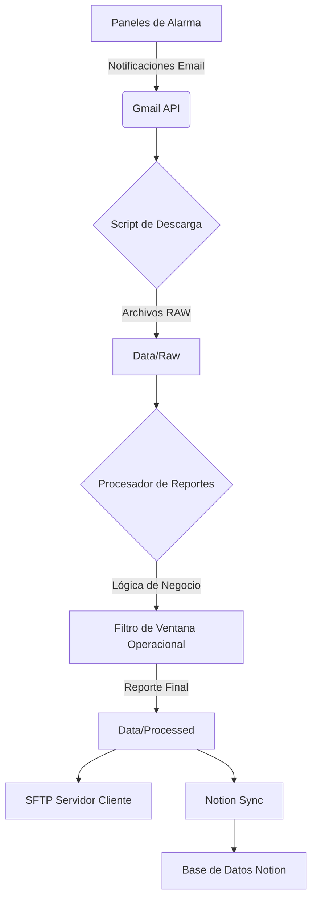
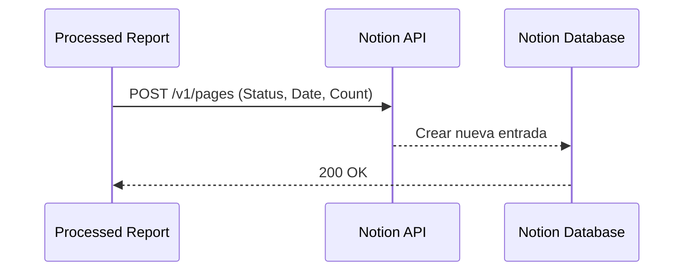

# Proyecto Reportes - Gestión de Intrusión

Este proyecto automatiza la descarga, procesamiento y consolidación de reportes de las aperturas y cierres e paneles de alarma para un **Cliente** corporativo.

## 🏗️ Descripción del Sistema de Intrusión

El sistema se basa en la monitorización de **Paneles de Alarma (DSC/Honeywell)** instalados en diversas sedes. Estos equipos envían reportes por correo electrónico y notificaciones en tiempo real cada vez que ocurre un evento de seguridad:

*   **Armado (Away/Stay):** Indica que el sistema de seguridad ha sido activado por un usuario autorizado.
*   **Desarmado:** Indica que el sistema ha sido desactivado por un usuario autorizado.
*   **Eventos de Medianoche (Midnight):** Reportes automáticos que confirman el estado actual del panel al final del día. (Debido a que los reportes de apertura y cierre tienen su corte en medianoche, los eventos posteriores alimentan al reporte final enviandose como notificaciones de armados.)

Este proyecto consolida estos reportes y notificaciones (que llegan vía email) en un reporte CSV estructurado para su posterior análisis en plataformas de Business Intelligence o registro en bases de datos.

## 📊 Flujo de Trabajo

## 🚀 Sincronización y Configuración

### 1. Protección de Datos (GitHub)
Este repositorio utiliza un archivo `.gitignore` para evitar que datos sensibles se suban a GitHub.
- **Archivos ignorados**: `config/config.ini`, `config/*.json`, `.env`, `data/`, `logs/`.
- **Plantillas**: Se incluyen `.env.example` y `config/config.ini.template` con datos genéricos.

### 2. Configuración Inicial
1. Clona el repositorio.
2. Copia `.env.example` a `.env` y configura tus variables.
3. Copia `config/config.ini.template` a `config/config.ini` y define las rutas y credenciales.
4. Coloca tus archivos `credentials.json` y `token.json` (Google API) en la carpeta `config/`.

### 3. Sincronización con Notion

1. Crea una [Integración en Notion](https://www.notion.so/my-integrations).
2. Obtén tu **Internal Integration Token**.
3. Comparte una Base de Datos con tu integración.
4. Agrega el **Database ID** y el **Token** a tu archivo `.env`.

### 5. Historial de Cambios
Para una bitácora detallada de los problemas resueltos y las mejoras implementadas, consulte el archivo [CHANGELOG.md](file:///d:/Antigravity/Proyecto%20Reportes%20DC/CHANGELOG.md).
